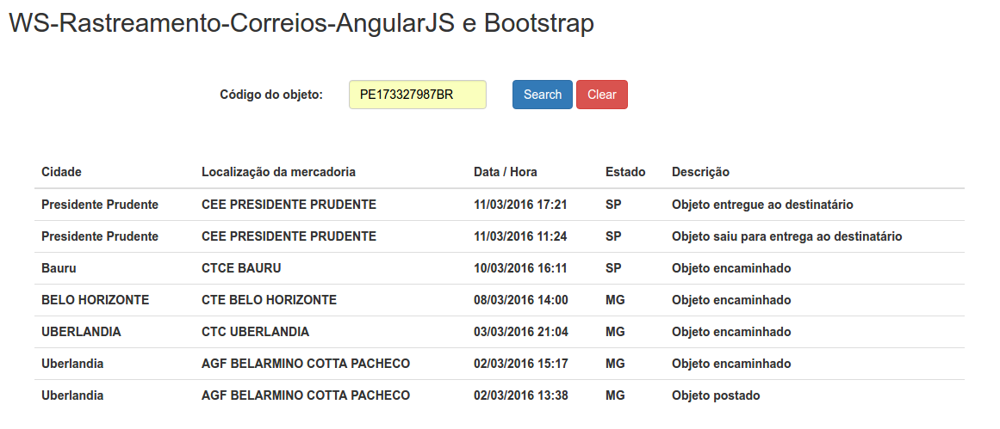
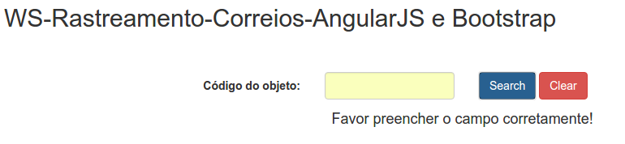

# ws-rastreamento-correios-angularjs
Find status / localization / city etc... of the merchandise

## Objetivo

Esse projeto tem por finalidade, criar um serviço AJAX, que é consumido em seu retorno as informações de um WebService(WS) em JSON. Buscando a situação da mercadoria pelo objeto do correios(postado/entregue/extraviado/longe de casa ;D). Conforme os prints acima. 
WS utilizado (https://correiosapi.herokuapp.com/package/ + objeto correios) 
Ex: https://correiosapi.herokuapp.com/package/PE173327987BR

## Tecnologias utilizadas

  HTML, CSS, JSON, AJAX, BOOTSTRAP, ANGULARJS, JQUERY
			 
Como executar?

## Não tem segredo. Só baixar, abrir o index.html e usar! 
